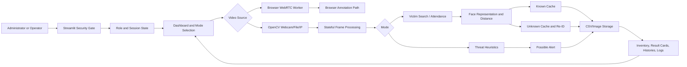
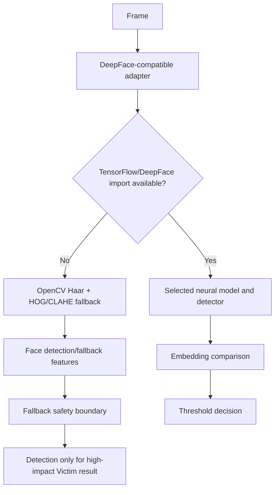
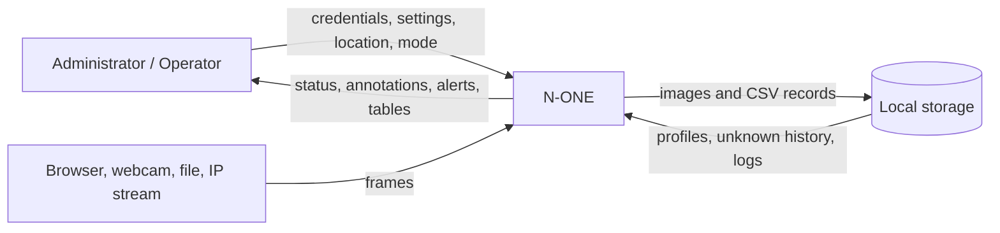
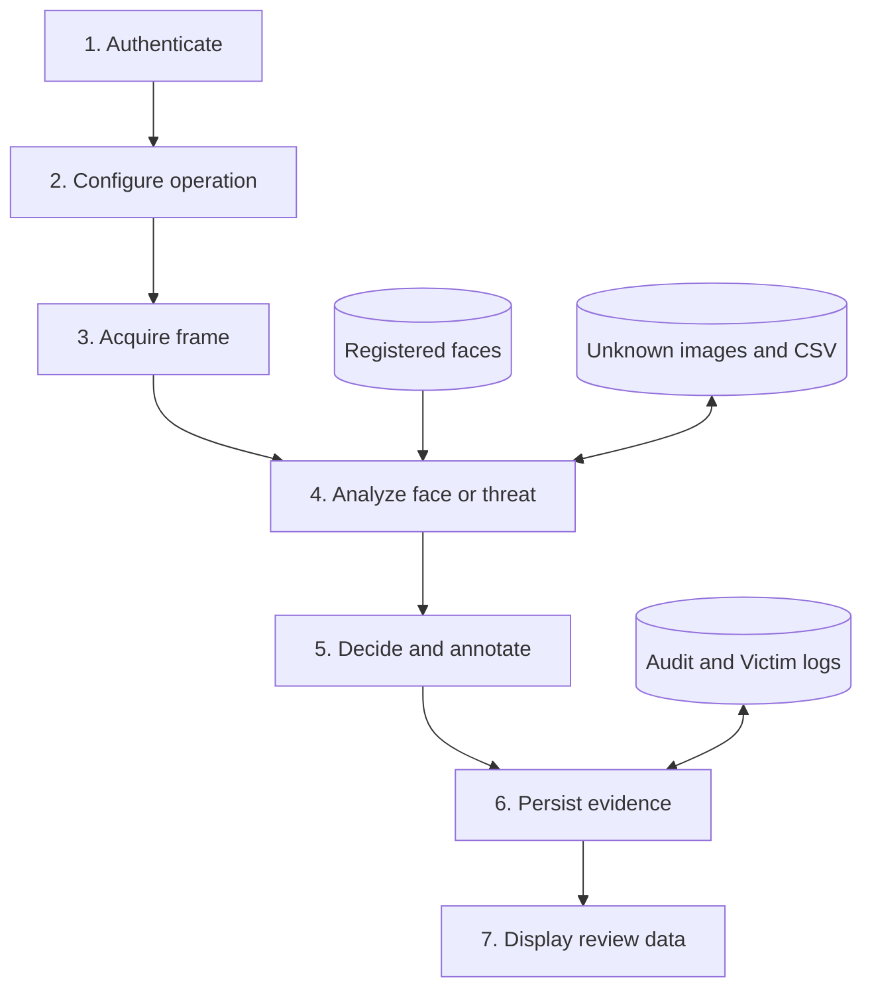
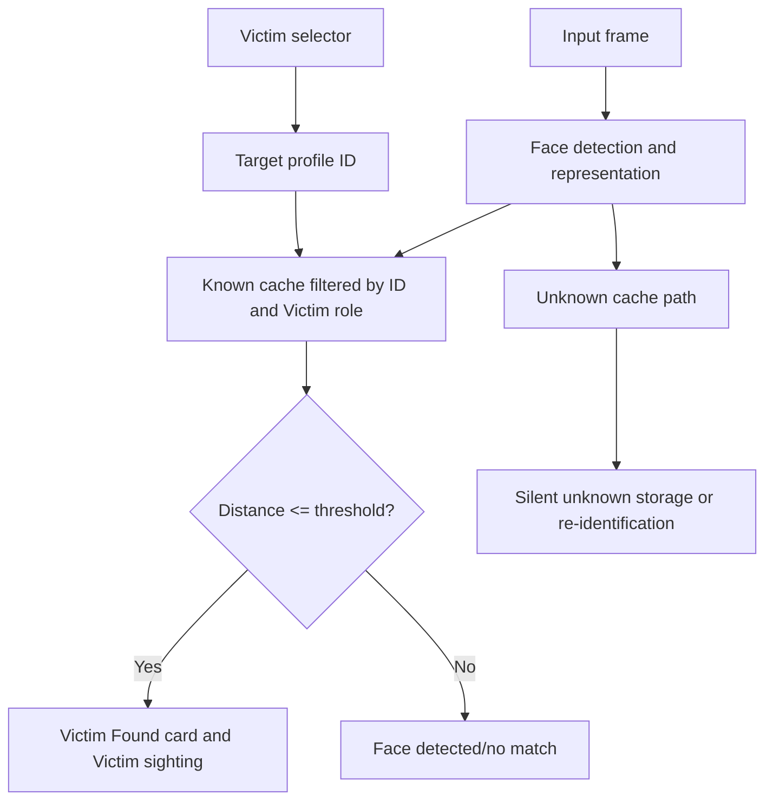
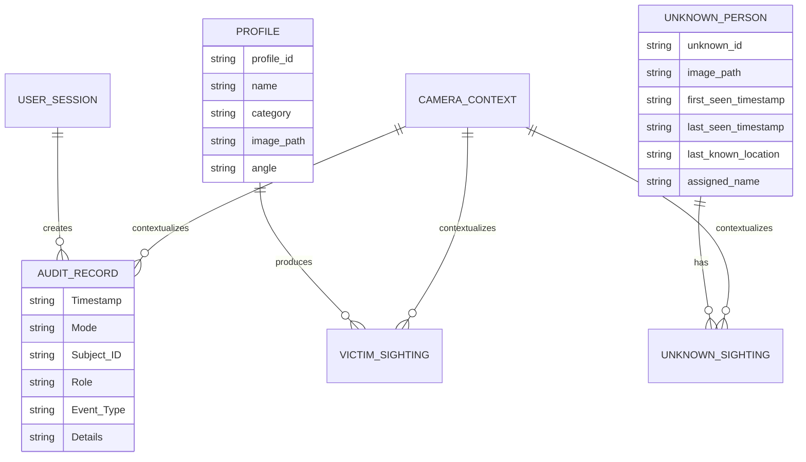
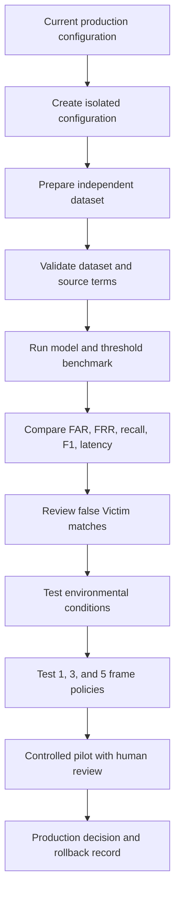

# N-ONE PROJECT REPORT
## No One Escapes

**Project domain:** AI-assisted victim identification, staff recognition, unknown-person re-identification, and heuristic threat monitoring

**Repository audit date:** 25 September 2026

**Implementation source of truth:** `app.py`, `deepface_adapter.py`, project tests, evaluation scripts/results, configuration files, and repository documentation.

## Abstract

N-ONE, expanded as **No One Escapes**, is a Python and Streamlit surveillance dashboard intended to assist operators with three related but distinct workflows: Lost Person Search, Member Attendance Logger, and Threat Detection Mode. The application supports browser camera input through WebRTC when the optional media stack is installed, as well as host webcams, recorded video files, and IP camera URLs through OpenCV. It places an authentication gate before the dashboard and distinguishes Administrator and Operator privileges.

For face-oriented modes, the application detects faces, generates a representation through a DeepFace-compatible interface, calculates a distance against registered or previously unknown face representations, and applies a configurable threshold. Registered profiles are stored as face-only image crops under `registered_faces/`. Unknown people can be assigned sequential local identifiers and recorded in `unknown_faces/`, `unknown_person_db.csv`, and `unknown_sighting_log.csv`. Victim sightings are stored separately in `detection_logs/victim_sighting_log.csv`. A main audit CSV records mode, subject, role, event type, and details.

The full DeepFace/TensorFlow path is conditional. In the audited lightweight runtime, the adapter falls back to OpenCV Haar frontal/profile detection and a CLAHE-normalized HOG descriptor. Because handcrafted fallback features are not treated as a sufficiently reliable identity basis for a high-impact Victim alert, the application disables identity matching for Victim identification when the neural runtime is unavailable. The source default remains FaceNet (`Facenet`) with OpenCV detection, cosine distance, and threshold `0.40`. A separate benchmark evaluated FaceNet, FaceNet512, and ArcFace with RetinaFace and cosine distance. At threshold `0.40`, ArcFace produced the strongest measured recall and F1 in that limited dataset while all three models produced zero false Victim matches in the available negative trials. This result is a benchmark-supported candidate, not a universal accuracy claim or an automatic production change.

The project is an integrated prototype rather than a distributed production surveillance platform. It does not demonstrate password hashing, encryption at rest, a relational database, a trained N-ONE neural network, staff-specific accuracy, unknown-re-identification accuracy, threat-detection accuracy, or multi-frame validation. These boundaries are included explicitly so that the report remains faithful to the repository.

**Keywords:** face recognition, victim search, staff recognition, unknown re-identification, OpenCV, DeepFace, Streamlit, RetinaFace, cosine distance, CSV logging, computer vision, threat heuristic.

## Table of Contents

The final Microsoft Word document should generate this section automatically from Heading 1, Heading 2, and Heading 3 styles. The chapter structure is given below.

## List of Figures

The complete figure plan is maintained in `N_ONE_REPORT_FIGURES.md`. The report should include Figures 1 through 16, with screenshots inserted only when they are captured from the actual application or supplied as approved evidence.

## List of Tables

The complete table plan is maintained in `N_ONE_REPORT_TABLES.md`. Measured benchmark tables in Chapter 14 reproduce repository CSV values.

## List of Abbreviations

| Abbreviation | Meaning |
|---|---|
| AI | Artificial Intelligence |
| API | Application Programming Interface |
| CSV | Comma-Separated Values |
| DFD | Data Flow Diagram |
| FAR | False Accept Rate |
| FNR | False Negative Rate |
| FPR | False Positive Rate |
| FRR | False Reject Rate |
| HOG | Histogram of Oriented Gradients |
| HSV | Hue, Saturation, Value |
| IP | Internet Protocol |
| LFW | Labeled Faces in the Wild |
| RBAC | Role-Based Access Control |
| RTSP | Real-Time Streaming Protocol |
| TN | True Negative |
| TP | True Positive |
| WebRTC | Web Real-Time Communication |

---

# CHAPTER 1 - INTRODUCTION

## 1.1 Background

Surveillance operators often work with video feeds that contain repeated, ambiguous visual events. A person may need to be located across a camera network, authorized staff may need to be recognized at an entry point, and an unusual object may require attention. Manual review can be slow and difficult to document consistently. A software system can assist by organizing inputs, applying repeatable visual checks, recording decisions, and keeping operational evidence available for later review.

N-ONE is designed as an integrated dashboard for this assistance role. Its value is not that it replaces a trained operator or establishes absolute identity. Its value is that it joins camera acquisition, profile enrollment, face comparison, unknown-person history, location-aware logging, and a threat-heuristic display in one workflow.

## 1.2 AI surveillance and computer vision

Computer vision systems typically separate image acquisition, detection, representation, comparison or classification, and presentation. N-ONE follows this pattern. A frame is acquired, faces or possible threat regions are identified, a branch-specific analysis is run, and the resulting status is shown in the Streamlit UI. The architecture is intentionally modular at the function level even though the deployment is a single Python process.

## 1.3 Face recognition context

A face-recognition pipeline is different from a simple face detector. Detection answers where a face-like region is located. Representation converts the region into numerical features. Comparison measures how close the current representation is to an enrolled representation. A threshold converts the distance into a decision. N-ONE's full DeepFace route can use pretrained recognition model interfaces, while the active fallback uses OpenCV detection and HOG/CLAHE features. The report therefore distinguishes the neural route from the fallback route throughout.

## 1.4 Victim identification problem

Lost Person Search is a one-target verification workflow. The operator selects one registered Victim profile and supplies a camera location. The implementation restricts visible known matching to that profile and the Victim role. Other faces may be silently tracked in the unknown store, but they are not displayed as the selected Victim. This reduces the risk that a different registered person is presented as the search target.

## 1.5 Need for N-ONE

The project addresses five practical needs:

1. A single dashboard for several operational modes.
2. A controlled registration workflow that stores face crops rather than arbitrary full images.
3. A target-restricted Victim search.
4. Persistent unknown-person IDs and location history.
5. A structured audit trail and evidence-oriented evaluation workspace.

## 1.6 Project overview

The application starts by creating required directories and CSV headers, configuring Streamlit session state, rendering the authentication gate, and then rendering the authenticated dashboard. An Administrator can register profiles and change model settings. An Operator can search, monitor, inspect the inventory, and review logs. The active mode determines whether frames use face processing or the separate threat heuristic branch.

## 1.7 Report organization

Chapters 1-5 establish the motivation, objectives, scope, problem, and benefits. Chapters 6-13 describe modules, technology, configuration, architecture, data flow, logical data entities, the end-to-end workflow, and implementation excerpts. Chapters 14-18 present measured results, tests, security and privacy considerations, limitations, future scope, and conclusions. Chapter 19 lists references. Appendices preserve evidence plans and missing academic inputs.

---

# CHAPTER 2 - OBJECTIVES OF THE PROJECT

## 2.1 Primary objective

The primary objective is to implement an authenticated Streamlit dashboard that assists with face-based Victim Search, registered-person recognition, unknown-person tracking, and heuristic threat monitoring through local or browser video sources.

## 2.2 Functional objectives

- Authenticate Administrator and Operator roles.
- Register Staff and Victim profiles from uploaded or captured images.
- Require exactly one detectable face during registration.
- Save padded face-only crops using predictable profile IDs.
- Search for one selected Victim.
- Compare registered profiles during attendance-style operation.
- Register and re-identify unknown people locally.
- Record Victim sightings with camera location.
- Detect possible elongated weapon-like contours and warm fire-like regions.
- Display status, photos, inventory, and logs.

## 2.3 Technical objectives

The project uses OpenCV, NumPy, pandas, Pillow, Streamlit, and a DeepFace-compatible adapter. It supports selectable model, detector, metric, and threshold settings through the Administrator sidebar. The code caps processing width at 1280 pixels for the main OpenCV path and maintains in-memory known and unknown face caches.

## 2.4 Security objectives

The application requires four configured secret values, compares submitted credentials with constant-time comparison, keeps the system locked when secrets are missing, and applies a temporary lockout after repeated failed attempts. Role conditions hide Administrator controls from Operators. These controls improve access separation but do not constitute a complete production identity and data-protection system.

## 2.5 Evaluation objectives

The evaluation workspace keeps enrollment and test paths separate, validates dataset structure, records source metadata, compares three recognition models at multiple thresholds, and reports TP, TN, FP, FN, precision, recall, F1, FAR, and FRR. It explicitly records multi-frame status as unavailable when sequence data is absent.

## 2.6 Expected outcomes

The expected outcome is a demonstrable prototype with reproducible local workflows, source-backed benchmark evidence, and clearly documented limitations. It is not an expectation of universal identity accuracy, guaranteed Victim discovery, or verified threat classification.

---

# CHAPTER 3 - SCOPE OF THE PROJECT

## 3.1 Functional scope

The implemented scope includes authentication, profile registration, inventory, photo viewing, three operational modes, several video sources, local face storage, unknown tracking, Victim sighting history, audit logs, and optional DeepFace-related analytics hooks.

## 3.2 Operational scope

The application is intended for a controlled local or small demonstration environment. A single Streamlit process manages the UI, frame acquisition, in-memory caches, and file writes. IP camera access is represented by passing a URL to OpenCV; a central multi-camera orchestration service is not implemented.

## 3.3 AI scope

The active fallback is a CPU-oriented OpenCV/HOG pipeline. The full runtime can expose models including FaceNet, FaceNet512, ArcFace, and others through the DeepFace interface when compatible dependencies are installed. The project does not train a new neural network from scratch.

## 3.4 Security scope

Secret loading, role gating, lockout, logout, and administrator-only destructive actions are implemented. Password hashing, encrypted images, encrypted CSVs, TLS configuration, external identity federation, and a persistent security event store are outside the current implementation.

## 3.5 Dataset scope

The benchmark uses five Victim identities, 11 enrollment images, 32 genuine Victim test images, ten impostor identities represented by 12 images, and 60 negative trials formed by comparing each impostor image against five Victim identities. Impostor source metadata identifies LFW as the source. This is a limited still-image evaluation.

## 3.6 Out-of-scope areas

Staff-specific recognition accuracy, Unknown Re-ID accuracy, threat-detection accuracy, production camera scalability, multi-frame confirmation metrics, legal compliance certification, and institutional academic details are not established by the repository.

---

# CHAPTER 4 - PROBLEM DEFINITION

## 4.1 Existing surveillance problem

Traditional review workflows divide recording, recognition, incident notes, and evidence storage across tools. This fragmentation creates repeated manual work and makes it harder to correlate a face, location, timestamp, and operational decision.

## 4.2 Recognition failure conditions

Face systems are affected by illumination, pose, blur, camera distance, occlusion, partial faces, multiple faces, detector mistakes, and changes between enrollment and observation. N-ONE's registration checks improve input quality but do not remove these environmental constraints.

## 4.3 False positive and false negative risks

A false positive in Victim Search means an impostor is presented as the selected Victim. A false negative means a genuine Victim observation is not accepted. The source code intentionally treats a fallback identity decision as unsafe for visible Victim identification when the neural runtime is unavailable. The benchmark reports these trade-offs using FP/FN, FAR/FRR, recall, and F1.

## 4.4 Unknown-person problem

An unknown is not a verified identity. It is a locally assigned representation for an observation that did not match a registered profile and that may match a previously saved unknown. Unknown Re-ID asks whether two unknown observations appear to be the same locally tracked person. It is therefore different from Victim Search, which checks a known target identity.

## 4.5 Threat-detection problem

The threat branch looks for visual patterns that may resemble elongated objects or warm fire-like regions. Contours and colour masks cannot prove that a region is a gun, knife, or fire. The application uses labels such as `Possible weapon` and `Possible fire`, and the report treats these as heuristic alerts requiring human review.

## 4.6 Formal problem statement

Given an input frame $F$, an operational mode $M$, an optional selected Victim profile $V$, a location $L$, a representation function $R$, and a distance threshold $\tau$, the system must produce a mode-appropriate status without confusing an unknown person with the selected Victim. In face modes, each detected face is represented and compared. In Threat Detection Mode, face comparison is skipped and the frame is processed by contour and HSV heuristics. All decisions must be described with their evidence limits.

---

# CHAPTER 5 - BENEFITS OF THE PROJECT

N-ONE offers an integrated operator workflow, predictable local data paths, target-restricted Victim Search, repeat-unknown context, and a reviewable CSV audit trail. The registration flow promotes better enrollment by requiring one visible face and saving only the face crop. The evaluation workspace separates benchmark evidence from live application defaults, allowing a model change to be considered without silently changing production behavior.

The benefits are conditional. They do not establish a measured application FPS, universal recognition accuracy, guaranteed threat detection, or legal compliance. A human operator remains necessary for context, confirmation, escalation, and ethical use.

---

# CHAPTER 6 - MAIN MODULES

## 6.1 Authentication and RBAC

`load_auth_credentials()` reads `ADMIN_USERNAME`, `ADMIN_PASSWORD`, `OPERATOR_USERNAME`, and `OPERATOR_PASSWORD` from the process environment or Streamlit Secrets. If any value is missing, it raises an error and the dashboard remains unavailable. After successful comparison, session state stores `authenticated=True` and the selected role. Administrators receive registration, model configuration, and deletion controls. Operators receive monitoring and review controls without those destructive or configuration controls.

## 6.2 Profile registration

The Administrator chooses guided multi-angle capture or upload. Guided capture expects front, left, right, up, and down angles. Each image is decoded, face regions are detected, and exactly one face with a minimum size is required. A 25% padded crop is saved under a generated Staff or Victim profile ID. Existing angle files for the same ID are replaced during an update.

## 6.3 Camera ingestion

The browser camera uses an optional WebRTC processor. Local webcams use OpenCV probing across camera indices and Windows backends. Recorded files are written to `temp_video_upload.mp4`. IP camera URLs are passed to OpenCV. A remote deployment should prefer browser capture because the server process cannot directly access a user's local camera.

## 6.4 Face recognition and matching

The active DeepFace-compatible object returns face regions and embeddings. The application searches the known cache first. In Victim Search, the search is restricted by profile ID and role. In attendance operation, all known profiles are candidates. Unmatched faces are checked against the unknown cache and then registered if no prior unknown matches.

## 6.5 Unknown Re-ID

A new unknown receives `unknown_001`, `unknown_002`, and so on. Its crop is saved, its first and last sighting metadata is added to `unknown_person_db.csv`, and a sighting row is appended. A later match updates the last-known location and timestamp and writes another sighting subject to a two-second write throttle for the same ID/location pair.

## 6.6 Victim Search

The operator selects a Victim and enters a camera location before starting. A genuine match creates the `Victim Found` event and a dedicated result card with the profile image, ID, location, distance, timestamp, active model/backend/metric, and latest sighting per location. In the OpenCV fallback, visible identity matching is disabled; the UI can confirm face detection without labeling a Victim.

## 6.7 Threat Detection

Threat mode is exclusive. It does not use FaceNet, FaceNet512, ArcFace, or the cosine threshold. It applies Canny edges, morphology, contour geometry, and a warm-colour HSV mask. Alerts are throttled before audit logging. The output is explicitly possible threat/fire, not verified classification.

## 6.8 Dashboard and logs

The dashboard shows role, registered counts, unknown counts, and total log events. Authenticated users can filter registered faces by All, Staff, and Victim, view photos and metadata, inspect unknown records, and review Victim sighting history.

### Table 4 - Project modules

| Module | Status | Main output |
|---|---|---|
| Authentication/RBAC | Implemented | Role-gated session |
| Registration | Implemented | Face-only profile images |
| Victim Search | Implemented with runtime dependency boundary | Target result or no-match |
| Staff/Attendance | Implemented workflow; Staff benchmark unavailable | Known/unknown status |
| Unknown Re-ID | Implemented local storage workflow; accuracy unavailable | Unknown ID/history |
| Threat Detection | Implemented heuristic path | Possible threat/fire alert |
| WebRTC camera | Optional/conditional | Worker-thread annotation |
| Evaluation | Implemented evidence workspace | CSV metrics |
| New neural training | Not implemented | None |

---

# CHAPTER 7 - TECHNICAL OVERVIEW

## 7.1 Technology stack

| Technology | Confirmed role |
|---|---|
| Python | Application language |
| Streamlit 1.60.0 | Dashboard and session state |
| OpenCV | Image/video processing, Haar detection, contours, annotations |
| NumPy | Array and distance calculations |
| pandas | CSV persistence and tabular display |
| Pillow | Uploaded-image decoding |
| DeepFace 0.0.100 | Conditional neural face-analysis interface |
| TensorFlow | Conditional dependency for full neural runtime |
| streamlit-webrtc 0.77.0 | Optional browser camera path on supported Python versions |
| PyAV | Optional WebRTC frame conversion |

## 7.2 DeepFace and model roles

FaceNet, FaceNet512, and ArcFace are representation models used for face comparison when the full runtime is active. RetinaFace is a detector, not an identity model. OpenCV is the source default detector. Threat detection is a separate contour/HSV path and must not be described as FaceNet weapon detection.

## 7.3 Cosine distance

For vectors $a$ and $b$:

$$d_{cos}(a,b)=1-\frac{a\cdot b}{\|a\|\|b\|}$$

N-ONE treats a smaller distance as more similar and accepts a match when the distance is less than or equal to the selected threshold. The default threshold is `0.40`, but thresholds are model- and detector-specific.

## 7.4 Fallback representation

`OpenCVFaceBackend` uses frontal and profile Haar cascades, equalized grayscale, optional upscaling, and overlapping-box deduplication. It extracts a 64x64 grayscale crop, applies CLAHE, computes a HOG descriptor, and normalizes the vector. This is a lightweight fallback, not a trained identity network.

## 7.5 Implemented and conditional features

The UI includes hooks for attributes, face extraction, one-to-one verification, and anti-spoofing. Their actual availability depends on the loaded backend. The active fallback implements the core representation/find/verify adapter surface but does not provide evidence that all neural attribute or liveness operations are active in the audited environment.

---

# CHAPTER 8 - SYSTEM CONFIGURATION

## 8.1 Software configuration

The base requirements target Python 3.10+ and document support for the OpenCV fallback on Python 3.14. The optional neural requirements target Python 3.10-3.13 because TensorFlow wheels are environment-dependent. The audited benchmark environment was Python 3.12.10 on Windows 11. The benchmark report says RAM was unavailable and GPU was not measured; CPU execution was requested.

## 8.2 Hardware configuration

The repository does not provide a measured application hardware profile. The benchmark provides processor text but no complete deployment specification. Therefore, this report does not claim an application minimum CPU, RAM, GPU, FPS, or camera count. A final university submission should add the actual demonstration machine details.

## 8.3 Network and camera configuration

Browser capture requires browser permission and WebRTC dependencies. Host webcam and file/IP-stream processing use OpenCV. RTSP credentials or URLs must not be copied into the academic report.

## 8.4 Configuration table

| Parameter | Current source value/status |
|---|---|
| Recognition model default | `Facenet` |
| Detector default | `opencv` |
| Metric default | `cosine` |
| Threshold default | `0.40` |
| Processing width cap | `1280` pixels |
| Victim duplicate suppression | Same profile/location under 60 seconds |
| Unknown sighting write interval | 2 seconds per ID/location |
| Login attempts | 5 before lockout |
| Login lockout | 60 seconds |
| Application RAM/FPS/GPU | Not measured in current implementation/evaluation |

---

# CHAPTER 9 - BLOCK DIAGRAM AND SYSTEM ARCHITECTURE

## 9.1 Overall architecture



The architecture has a presentation layer, processing layer, and local storage layer. The application is monolithic; function boundaries provide organization but there is no separate service layer or database server.

## 9.2 Conditional AI boundary



## 9.3 Module architecture

Figure 2 should show the modules listed in Chapter 6. Figure 9 should show storage. Figure 10 should show the recognition pipeline. The formal figure plan is in `N_ONE_REPORT_FIGURES.md`.

---

# CHAPTER 10 - DATA FLOW DIAGRAMS

## 10.1 Context DFD



## 10.2 Level-0 DFD



## 10.3 Victim Search DFD



## 10.4 Data stores

The actual stores are image directories and CSV files. There is no SQL ER implementation. The logical entity model in Chapter 11 is therefore a documentation model derived from the file formats.

---

# CHAPTER 11 - LOGICAL ER / DATA MODEL

## 11.1 Logical entities

- **User session:** role, authentication state, selected settings.
- **Profile:** profile ID, name, category, image paths, angle.
- **Unknown Person:** unknown ID, image path, first/last timestamps, last location, optional assigned name.
- **Unknown Sighting:** sighting ID, unknown ID, timestamp, location.
- **Victim Sighting:** profile ID, name, timestamp, location.
- **Audit Record:** timestamp, mode, subject ID, role, event type, details.
- **Camera context:** operator-entered location associated with an event.

## 11.2 Logical relationship diagram



This is a logical data model, not a claim that the application creates SQL tables or enforces relational constraints.

---

# CHAPTER 12 - PROJECT EXPLANATION

## 12.1 Startup

`main()` initializes directories and log files, sets session defaults, renders the sidebar, loads known encodings for authenticated sessions, and renders the main UI, analytics panel, and log viewer. Missing credentials leave the system locked.

## 12.2 Authentication

The Administrator or Operator enters credentials in the sidebar. The application reads secret values from the environment or Streamlit Secrets, compares values, assigns a role, and reruns the page. After five failures the session is locked for 60 seconds. Logout clears authentication and role state.

## 12.3 Profile enrollment

A registration image is read with Pillow and converted to BGR. Face regions are obtained through the loaded backend. Exactly one region is required. The crop receives padding and is written to the registered directory. In guided mode, five angle files are associated with one profile ID.

## 12.4 Victim Search

The operator selects `1. Lost Person Search`, chooses one Victim, enters a camera location, selects a source, and starts surveillance. The stateful OpenCV path processes each frame. In the neural path, the face is compared only with the selected Victim cache entries. A match is recorded, annotated, and shown in a dedicated card. A non-match is not assigned the Victim identity. The fallback path reports that identity matching requires the neural runtime.

## 12.5 Staff Recognition / Attendance

The attendance mode compares detected faces with the unrestricted known cache. A registered match is labeled. If no registered match is found, the system checks the unknown cache, displays a previous unknown ID when found, or saves a new unknown crop and metadata.

The repository does not contain an independent Staff benchmark. Therefore, no Victim benchmark number is reused here. Staff-specific recognition accuracy is **Not measured in the current implementation/evaluation.**

## 12.6 Unknown Re-ID

A locally saved unknown image is treated as a reference representation. A later face is compared with the unknown cache using the selected metric and mode-specific threshold map. A repeat updates the last sighting and appends a log row. The system's unknown ID is an application identifier, not a legal identity.

## 12.7 Threat Detection

The threat mode runs `check_weapon_contours()` and returns before face processing. Edge contours are filtered by area, aspect ratio, fill ratio, and solidity. A separate HSV mask searches for saturated warm regions. The result can be `Possible weapon`, `Possible fire`, or no threat. No FaceNet model or face threshold is involved.

## 12.8 Browser WebRTC path

The browser path uses a worker-thread processor. It annotates frames but deliberately avoids Streamlit state writes, CSV logging, and disk writes in the callback. The latest selected-Victim result is placed in a protected status object and polled by the UI. This behavior differs from the stateful OpenCV loop and should be described separately in an academic demonstration.

## 12.9 Error handling

The application handles missing optional WebRTC imports, missing secrets, invalid image files, no-face and multiple-face registration cases, black frames, unavailable camera sources, missing files, CSV parsing failures, and backend exceptions. Some optional analytics helpers return a fallback result when the backend is unavailable. Those fallbacks must not be described as successful liveness or attribute inference.

---

# CHAPTER 13 - CODING / IMPLEMENTATION

The report should include short, readable code listings rather than dumping `app.py`. The following excerpts are representative source-backed listings.

## 13.1 Authentication secret loading

**File:** `app.py`  
**Function:** `_read_secret()` and `load_auth_credentials()`  
**Purpose:** Load required credentials without hardcoding them.

```python
def _read_secret(name: str) -> str | None:
    environment_value = os.getenv(name)
    if environment_value is not None:
        return environment_value
    try:
        secret_value = st.secrets.get(name)
    except StreamlitSecretNotFoundError:
        return None
    return None if secret_value is None else str(secret_value)
```

The function checks process configuration first and Streamlit Secrets second. It returns no secret value when the configuration source is unavailable. `load_auth_credentials()` rejects incomplete configuration, which prevents an accidental default-login path.

## 13.2 Distance calculation

```python
def calculate_face_distance(face_encoding, reference_encoding, metric="cosine"):
    probe = np.asarray(face_encoding, dtype=np.float64)
    reference = np.asarray(reference_encoding, dtype=np.float64)
    if probe.shape != reference.shape:
        raise ValueError("Face embedding dimensions do not match")
    if not np.all(np.isfinite(probe)) or not np.all(np.isfinite(reference)):
        raise ValueError("Face embedding contains non-finite values")
    if metric == "euclidean":
        return float(np.linalg.norm(probe - reference))
    if metric == "euclidean_l2":
        return float(np.linalg.norm(probe - reference) /
                     max(np.linalg.norm(probe) + np.linalg.norm(reference), 1e-8))
    return float(1.0 - np.dot(probe, reference) /
                 (np.linalg.norm(probe) * np.linalg.norm(reference)))
```

The implementation validates shape and finite values. A zero vector is treated as a non-match in the current source path.

## 13.3 Target-restricted matching

```python
known_match = find_face_in_known_cache(
    face_encoding,
    match_threshold,
    profile_id=target_profile_id,
    role="Victim",
    metric=metric,
) if target_profile_id else None
```

The profile ID and role filter are the controlling safeguards for visible Victim Search identity results. A different registered profile cannot satisfy this branch.

## 13.4 Registration validation

```python
regions = detect_face_regions(frame)
if len(regions) == 0:
    return None, "No face detected. Face the camera directly with good lighting."
if len(regions) > 1:
    return None, "Multiple faces detected. Keep only one person in the frame."
```

The code then checks the minimum crop size, applies padding, and returns the face-only crop for persistence.

## 13.5 Threat heuristic boundary

```python
if aspect_ratio >= 2.5 and fill_ratio >= 0.08 and solidity >= 0.15:
    boxes.append((x, y, w, h, "Possible weapon"))
```

The label is intentionally `Possible weapon`. The source docstring states that contour analysis cannot prove an object is a gun or knife. That wording is required in the report and operator UI interpretation.

## 13.6 Unknown registration

`register_new_unknown()` creates a sequential ID, writes the face crop, appends a row to the unknown database, appends the first sighting, and writes an audit event. `update_unknown_sighting()` updates last-seen metadata and logs later sightings with a short duplicate-write interval.

## 13.7 Implementation limitations

The single-module design makes the prototype easy to run but concentrates UI, storage, and processing responsibilities in `app.py`. Direct CSV writes can be vulnerable to concurrent-access problems in a multi-worker deployment. The project does not add a database transaction layer, schema migration system, or encrypted storage wrapper.

---

# CHAPTER 14 - RESULT AND ANALYSIS

## 14.1 Evaluation protocol

The benchmark separates Victim enrollment images from Victim test images. It uses five Victim identities, 11 enrollment images, 32 genuine test images, ten impostor identities represented by 12 images, and 60 negative trials. The detector/backend is RetinaFace where supported, the distance metric is cosine, and the tested threshold range is 0.20 through 0.60.

A genuine trial is a test image of the target Victim. An impostor trial compares an impostor image against a Victim identity. A decision is accepted when the minimum distance to the target's enrollment representations is less than or equal to the threshold.

## 14.2 Threshold-0.40 model comparison

| Model | TP | TN | FP | FN | Precision | Recall | F1 | FAR | FRR | False Victim matches |
|---|---:|---:|---:|---:|---:|---:|---:|---:|---:|---:|
| FaceNet | 21 | 60 | 0 | 11 | 1.0000 | 0.65625 | 0.7924528302 | 0.0000 | 0.34375 | 0 |
| FaceNet512 | 22 | 60 | 0 | 10 | 1.0000 | 0.68750 | 0.8148148148 | 0.0000 | 0.31250 | 0 |
| ArcFace | 23 | 60 | 0 | 9 | 1.0000 | 0.71875 | 0.8363636364 | 0.0000 | 0.28125 | 0 |

At threshold `0.40`, ArcFace produced the strongest measured recall and F1 among these three tested model configurations while recording zero false Victim matches in the available negative trials. The claim is limited to this dataset and protocol. It is not a universal accuracy claim, a safety guarantee, or an automatic production recommendation.

## 14.3 Threshold analysis

At threshold `0.40`, all three models had zero FP in 60 negative trials. The threshold sweep shows the trade-off when the threshold is relaxed. For example, FaceNet recorded one FP at `0.50` and `0.55`, and two FP at `0.60`; at `0.60`, FaceNet512 and ArcFace still recorded zero FP but their genuine acceptance counts did not automatically establish production superiority. Thresholds are model-specific and must be recalibrated on representative data.

## 14.4 Performance evidence

The benchmark performance file contains 55-image rows for each model. Average inference latency was approximately 3.5909591327 seconds for FaceNet, 3.9212489673 seconds for FaceNet512, and 3.8782448073 seconds for ArcFace in that benchmark run. The corresponding derived average FPS values were approximately 0.2784771315, 0.2550207876, and 0.2578486015. These are benchmark-run figures, not application-wide guarantees. The benchmark notes that inference latency includes detector, alignment/preprocessing, and embedding generation, and that GPU was not used.

## 14.5 Multi-frame evaluation

`multi_frame_results.csv` records `not_available` for all models and 1-, 3-, and 5-frame settings because no labeled video/frame sequences were present. Multi-frame 1/3/5 confirmation results are **Not measured in the current implementation/evaluation.** The current report therefore makes no claim that multi-frame confirmation improves accuracy. A future experiment must measure TP, TN, FP, FN, confirmation latency, and false Victim alerts at sequence level.

## 14.6 Production versus benchmark configuration

| Mode | Model | Detector | Metric | Threshold | Status |
|---|---|---|---|---:|---|
| Victim Search source default | FaceNet | OpenCV | Cosine | 0.40 | Current source default |
| Benchmark comparison | FaceNet | RetinaFace | Cosine | 0.40 | Measured benchmark row |
| Benchmark comparison | FaceNet512 | RetinaFace | Cosine | 0.40 | Measured benchmark row |
| Benchmark comparison | ArcFace | RetinaFace | Cosine | 0.40 | Benchmark candidate |
| Staff Recognition | Configured model | Configured detector | Configured metric | Configured threshold | Staff-specific benchmark unavailable |
| Unknown Re-ID | Configured model/fallback | Configured detector | Configured metric | Local threshold map | Accuracy unavailable |
| Threat Detection | Separate heuristic | N/A | N/A | N/A | Face model is not used |

## 14.7 Interpretation

The benchmark shows that genuine acceptance changes with model and threshold. It does not measure live camera conditions, staff operation, unknown re-identification, or threat detection. The repository correctly preserves the production default separately from the candidate benchmark configurations.

---

# CHAPTER 15 - SOFTWARE TESTING

## 15.1 Test strategy

The project contains unit tests for the adapter, profile inventory, unknown-store behavior, Victim target filtering, browser annotation safety, dataset paths, metadata, and collector validation. The tests are primarily behavior and boundary tests; they are not a full browser end-to-end suite.

## 15.2 Representative functional test table

| Test ID | Test case | Expected result | Evidence |
|---|---|---|---|
| T01 | Missing authentication secret | System remains unavailable and reports configuration error | `load_auth_credentials()` |
| T02 | Legacy Member profile | Categorized as Staff | `test_profile_labels_support_new_and_legacy_prefixes` |
| T03 | Legacy Lost profile | Categorized as Victim | Same test |
| T04 | Duplicate unknown DB rows | Count uses unique saved IDs | `test_unknown_count_uses_unique_database_ids` |
| T05 | Clear unknown data | Images/cache/CSV tracking reset | `test_clear_unknown_face_data_removes_photos_and_resets_tracking` |
| T06 | Victim cache restriction | Only selected Victim can match | `test_known_face_cache_can_be_limited_to_one_victim` |
| T07 | Five angle files | All saved angles enter cache | `test_known_face_database_refresh_includes_all_saved_angles` |
| T08 | Browser unmatched Victim | Green detection box, no identity | browser annotation test |
| T09 | Browser neural selected Victim | Red selected-Victim result | neural runtime test |
| T10 | Fallback Victim | No false identity label | fallback test |
| T11 | Dataset path traversal input | Path remains under dataset root | collector test |
| T12 | Enrollment face count | Exactly one face required | collector tests |
| T13 | Test image face count | At least one face required; multiple allowed | collector tests |

## 15.3 AI benchmark tests

The benchmark scripts validate model comparisons and threshold decisions using independent enrollment/test paths. The dataset metadata records conditions such as normal, angle, lighting, distance, blur, and multiple faces for Victim test images. The impostor source file records LFW identity/source references and hashes.

## 15.4 Test gaps

The repository does not contain a full Streamlit browser test, multi-user concurrency test, staff benchmark, unknown benchmark, threat benchmark, or labeled video sequence test. These gaps must remain visible in the submission.

## 15.5 Current validation status

The final audit attempted to execute the test suite with the project Python environments. The checked-in `new_venv` environment does not contain `pytest`, and the system Python 3.14 environment also reports `No module named pytest`; therefore a fresh test-run result cannot be claimed from this audit. A prior repository audit recorded 24 passed, 1 failed, and 1 error, but that result is historical evidence rather than a current rerun. The known assertion failure concerned the expected order of columns in `evaluation/dataset_metadata.csv` (`file_path` expected first by the test while the checked-in collector schema writes `id` first). The reported temporary-directory error was environment-related. These facts must be resolved or explicitly attached as test-run evidence before submission.

The evaluation folder also contains a documentation contradiction. The current measured result files and populated dataset are present, while older `evaluation/README.md` and `evaluation/dataset/README.md` text still describes the workspace as having no real evaluation data. The measured CSVs are used in Chapter 14 because they contain explicit values; the older status text is retained as legacy documentation and is not treated as a result.

---

# CHAPTER 16 - SECURITY, PRIVACY, AND ETHICAL CONSIDERATIONS

## 16.1 Authentication and authorization

The system fails closed without configured credentials, compares secrets with `hmac.compare_digest`, and locks the current session after repeated failures. Administrator-only controls include registration, model configuration, and destructive local-data operations. Operators can monitor and review but cannot access those controls through the UI.

## 16.2 Password security limitations

The repository does not demonstrate password hashing, rotation, MFA, external identity federation, or a persistent login audit store. Environment variables and Streamlit Secrets are preferable to committed credentials, but deployment operators remain responsible for secret protection.

## 16.3 Data protection

Face images, unknown images, camera locations, and event histories are stored locally as ordinary image and CSV files. The source does not implement encryption at rest, retention expiry, file-level permissions, or a formal deletion approval system beyond administrator UI confirmation. A production deployment should add those controls.

## 16.4 Privacy and ethical use

Face recognition should be used only with appropriate authority, notice, consent or other lawful basis, and human review. A match distance is not a percentage certainty. A possible threat is not proof of a weapon. A locally assigned unknown ID is not a confirmed identity. The application should not be used as the sole basis for detention, disciplinary action, or emergency escalation.

## 16.5 Dataset licensing

The impostor source file identifies LFW and preserves a source reference and terms note. Any final publication must include the required dataset attribution and check the applicable terms. The repository does not establish legal compliance with a specific jurisdiction.

---

# CHAPTER 17 - LIMITATIONS AND FUTURE SCOPE

## 17.1 Current limitations

1. The benchmark is small and still-image based.
2. Staff-specific recognition accuracy is **Not measured in the current implementation/evaluation.**
3. Unknown Re-ID accuracy is **Not measured in the current implementation/evaluation.**
4. Threat-detection accuracy is **Not measured in the current implementation/evaluation.**
5. Multi-frame metrics are unavailable.
6. The active fallback is not a trained neural identity model.
7. Lighting, pose, blur, distance, occlusion, detector errors, and multiple faces remain challenging.
8. WebRTC worker annotation does not perform the same CSV/session-state writes as the OpenCV path.
9. File-based storage is not designed for concurrent distributed production use.
10. Application RAM, CPU, GPU usage, maximum camera count, and operational FPS are **Not measured in the current implementation/evaluation.**
11. Password hashing, encryption, TLS, retention, and comprehensive security auditing are not implemented.
12. Threat labels are heuristic and require human review.

## 17.2 Safe model-change workflow



The current production configuration must be recorded before a change. Enrollment and test identities must remain separated. The candidate configuration must be evaluated with independent impostors, actual deployment conditions, detector availability, latency, and resource cost. The change should be approved only after false Victim cases have been reviewed.

## 17.3 Future work

- Add larger and more representative Victim, Staff, Unknown, and threat datasets.
- Measure Staff recognition and Unknown Re-ID independently.
- Add labeled video sequences and evaluate 1-, 3-, and 5-frame confirmation.
- Calibrate thresholds by model, detector, camera, and environment.
- Add a database or transactional event store for concurrent operation.
- Add password hashing or an external identity provider.
- Add encryption, retention, consent, audit, and incident-response controls.
- Add reproducible application FPS, latency, CPU, RAM, GPU, and scale tests.
- Add automated browser tests and controlled deployment validation.
- Evaluate a trained threat detector separately from face recognition.
- Introduce multi-camera orchestration only after single-camera behavior is measured.

---

# CHAPTER 18 - CONCLUSION

N-ONE is an implemented Streamlit prototype that combines authenticated operation, face-only profile enrollment, Victim Search, registered-person recognition, local unknown-person re-identification, heuristic threat monitoring, and CSV/image evidence storage. Its strongest design decision is the explicit separation of tasks: Victim Search is a selected known identity workflow, Unknown Re-ID is a local same-unknown workflow, and Threat Detection is independent of face recognition.

The repository contains meaningful benchmark evidence. At threshold `0.40`, ArcFace with RetinaFace and cosine distance produced the highest measured recall and F1 among FaceNet, FaceNet512, and ArcFace in the limited evaluation sample, with zero false Victim matches in the tested negative trials. The live source default remains FaceNet with OpenCV, cosine distance, and threshold `0.40`, and the audited lightweight runtime uses an OpenCV/HOG fallback when TensorFlow is unavailable. These facts must remain distinct.

The project is not a claim of universal accuracy or guaranteed safety. Staff, Unknown Re-ID, threat, and multi-frame performance remain unmeasured. Security and privacy controls require strengthening before production use. The appropriate next step is a controlled evaluation program with larger independent data, sequence-level validation, human review, stronger storage and identity controls, and reproducible deployment measurements.

---

# CHAPTER 19 - BIBLIOGRAPHY / REFERENCES

The final submission should verify access dates and use the university's required citation style.

1. Schroff, F., Kalenichenko, D., and Philbin, J. (2015). *FaceNet: A Unified Embedding for Face Recognition and Clustering*. Proceedings of CVPR.
2. Deng, J., Guo, J., Xue, N., and Zafeiriou, S. (2019). *ArcFace: Additive Angular Margin Loss for Deep Face Recognition*. Proceedings of CVPR.
3. OpenCV Documentation. *Cascade Classifier and Computer Vision Library Documentation*. https://docs.opencv.org/
4. Streamlit Documentation. *Streamlit Documentation*. https://docs.streamlit.io/
5. DeepFace project documentation and source tree included under the repository's `deepface/` directory. The project uses it conditionally through `deepface_adapter.py`.
6. Labeled Faces in the Wild source reference recorded in `evaluation/impostor_sources.csv`. The applicable dataset terms must be reviewed before publication.
7. N-ONE internal documentation: `README.md`, `BRAIN.md`, `ARCHITECTURE.md`, `AI_MODEL_CONFIGURATION.md`, `docs/AI_MODEL_EVALUATION_REPORT.md`, and `docs/AI_MODELS_AND_CONFIGURATION_GUIDE.md`.
8. N-ONE source and tests: `app.py`, `deepface_adapter.py`, `evaluation/scripts/`, and `tests/`.

---

# APPENDICES

## Appendix E - AI Benchmark Tables

Include the complete contents of `evaluation/results/model_comparison.csv`, `threshold_comparison.csv`, `performance_results.csv`, and `multi_frame_results.csv` after formatting them as Word tables. Do not alter measured values.

## Appendix F - Screenshots

Insert only approved screenshots listed in `N_ONE_REPORT_FIGURES.md`. Until they are supplied, use the exact label:

`[SCREENSHOT REQUIRED - NOT PRESENT IN REPOSITORY]`

## Appendix G - Test Cases

Include the functional table in Chapter 15 and attach the final test-run output. Mark a test Pass or Fail only when the run provides evidence.

## Appendix H - Project File Structure

```text
app.py
 deepface_adapter.py
 requirements.txt
 requirements-deepface.txt
 .env.example
 registered_faces/
 unknown_faces/
 unknown_person_db.csv
 unknown_sighting_log.csv
 detection_logs/
 evaluation/
 tests/
 docs/
 assets/
```

## Appendix I - Model Configuration Summary

| Mode | Configuration | Status |
|---|---|---|
| Victim Search | FaceNet + OpenCV + cosine + 0.40 | Current source default; identity safety depends on runtime availability |
| Neural benchmark | FaceNet/FaceNet512/ArcFace + RetinaFace + cosine + 0.40 | Measured candidate configurations |
| Staff Recognition | Runtime-selected profile configuration | Implemented workflow; benchmark unavailable |
| Unknown Re-ID | Runtime-selected representation and local cache | Implemented workflow; accuracy unavailable |
| Threat Detection | Canny/contour/HSV heuristic | Separate possible-alert path |

## Appendix J - Required Submission Audit

Before submission, verify that the final Word document includes the certificate, declaration, student details, approved screenshots, complete table of contents, figure captions, bibliography style, test evidence, and the missing-information checklist in `N_ONE_REPORT_MISSING_ITEMS.md`.

## Appendix K - Evidence and validation note

This Markdown report is an evidence-backed technical draft, not the final paginated Word/PDF submission. Its measured content is based on repository files available on 25 September 2026. The current word count is approximately 7,291 words, so the requested 70–80-page target has not been reached. Expanding to that target requires genuine additional material such as approved screenshots, verified institutional front matter, detailed source listings, reproducible test output, and any supplied deployment evidence. It must not be achieved by repeating claims or inventing measurements.
